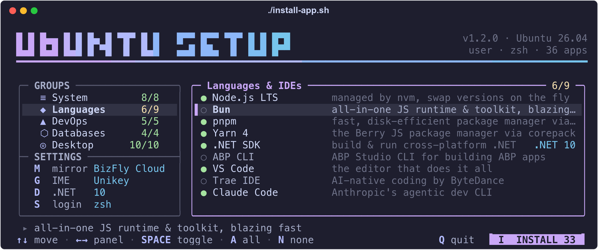

<h1 align="center">SETUP</h1>

<p align="center"><b>Post-install toolkit for Ubuntu 26.04</b><br/>Pick apps from a TUI menu on a fresh machine; the script installs them. Re-runs are safe and every app can be uninstalled.</p>

<p align="center">
  <a href="https://github.com/hoangld89/ubuntu-install-apps/releases/latest"></a>
  
  
  <a href="LICENSE"></a>
</p>

<p align="center"></p>

<p align="center">
  <a href="#features">Features</a> ·
  <a href="#quick-start">Quick start</a> ·
  <a href="#usage">Usage</a> ·
  <a href="#apps">Apps</a> ·
  <a href="#how-it-works">How it works</a> ·
  <a href="#troubleshooting">Troubleshooting</a> ·
  <a href="#contributing">Contributing</a>
</p>

## Features

- **36 apps in 5 groups** — shell, languages and IDEs, DevOps, databases, desktop apps.
- **Idempotent** — re-runs skip what is installed and move old installs onto the current upstream method.
- **Reversible** — every app has an uninstall that removes its packages, repos, keys and shell config.
- **Isolated steps** — a failing app ends only its own step; the rest of the run continues.
- **Vietnam-ready** — fast local APT mirrors, Fcitx5 Vietnamese input, fonts with full diacritics.

## Requirements

- Ubuntu 26.04 (resolute) amd64 — other releases get a warning and the run continues
- `sudo` and internet access
- A terminal at least 80 columns wide for the two-pane menu

## Quick start

```bash
git clone https://github.com/hoangld89/ubuntu-install-apps.git
cd ubuntu-install-apps
git checkout "$(git describe --tags --abbrev=0)"   # optional: pin the latest release
./install-app.sh
```

Launching with `sh` re-execs under bash.

## Usage

| Command | Action |
|---------|--------|
| `./install-app.sh` | Interactive install menu |
| `./install-app.sh --all` | Install every app |
| `./install-app.sh --uninstall` | Same menu, removes what you pick |
| `./install-app.sh --uninstall --all` | Uninstall every app |
| `./install-app.sh --keep-shell` | Keep your login shell (default: Terminal Kit switches to zsh) |
| `./install-app.sh --ascii` | Plain glyphs for fonts without box-drawing symbols (or `MINT_ASCII=1`) |
| `./install-app.sh --help` | Usage and running version |

### Menu keys

| Key | Action |
|-----|--------|
| `↑` `↓` / `k` `j` | Move within the focused pane |
| `←` `→` / `h` `l`, `Tab`, `Enter` | Switch between groups and apps |
| `Space`, `a`, `n` | Toggle app or whole group, select all, select none |
| `d` / `m` / `g` | .NET versions (8, 9, 10) / APT mirror / Vietnamese input engine (install only) |
| `s` | zsh as login shell yes/no (install only) |
| `i` / `q` | Start / quit |

Terminals narrower than 80 columns get a single list with collapsible groups (`Enter`). Colours are truecolor (Catppuccin Mocha) when `COLORTERM` is `truecolor`/`24bit`, 256 colours otherwise.

## Apps

<details open>
<summary><b>System & Shell</b></summary>

| App | How |
|-----|-----|
| APT mirror | Points the Ubuntu archive at a Vietnam mirror (`m` to pick), backs up the sources files; runs first |
| System update | `apt-get update`, `upgrade --with-new-pkgs`, `autoremove`, keeping existing config files |
| Swap | Grows `/swap.img` (or creates `/swapfile`) to 8 GB, `swappiness=10` |
| Terminal Kit | zsh + Oh My Zsh (git, zsh-autosuggestions, zsh-syntax-highlighting), tmux, htop, jq, yq, ripgrep, fzf, bat |
| Fonts | MesloLGS NF (set in gnome-terminal), Noto + Liberation for Vietnamese diacritics in browsers |
| MS Fonts | `ttf-mscorefonts-installer` plus Calibri/ClearType faces from PowerPoint Viewer |
| eza, Fastfetch | Ubuntu archive; eza adds `ls`/`ll`/`la`/`lt` aliases |

</details>

<details open>
<summary><b>Languages & IDEs</b></summary>

| App | How |
|-----|-----|
| Node.js LTS | nvm, `nvm install --lts`; a re-run moves to the next LTS line |
| Bun | `bun.sh/install`, per user |
| pnpm, Yarn 4 | corepack npm package (needs Node.js) |
| .NET SDK | 10 from the archive, 8/9 from `ppa:dotnet/backports` (end of support 2026-11-10) |
| ABP CLI | `Volo.Abp.Studio.Cli` dotnet tool (needs .NET) |
| VS Code | Microsoft apt repo |
| Trae IDE | `.deb` from Trae's release API; reinstalled when a new build appears |
| Claude Code | `claude.ai/install.sh` |

</details>

<details open>
<summary><b>DevOps & Cloud</b></summary>

| App | How |
|-----|-----|
| Terraform | HashiCorp apt repo |
| Azure CLI | Microsoft apt repo |
| AzCopy | v10 tarball → `/usr/local/bin/azcopy` |
| Docker | Docker apt repo (CE, Compose, buildx); removes conflicting distro packages, adds you to `docker` |
| BrowserStack Local | Official zip → `/usr/local/bin/BrowserStackLocal` |

</details>

<details open>
<summary><b>Databases</b></summary>

| App | How |
|-----|-----|
| MySQL / PostgreSQL clients | apt |
| DBeaver CE | `dbeaver.io` apt repo |
| Navicat Premium Lite 18 | AppImage in `/opt`, `navicat` command; backs up `~/.config/navicat` on upgrade |

</details>

<details open>
<summary><b>Apps & Desktop</b></summary>

| App | How |
|-----|-----|
| Chrome | `.deb` |
| Edge | Microsoft apt repo |
| Teams for Linux | `repo.teamsforlinux.de` (unofficial Electron client) |
| Fcitx5 | Unikey or Bamboo (archive) or Lotus (third-party repo); sets IM env vars, autostart, profile |
| Postman | Tarball → `/opt/Postman` |
| Waydroid | Official repo; needs Wayland + `binder`, run `waydroid init` once |
| VLC | apt |
| OBS Studio | `ppa:obsproject/obs-studio` |
| AnyDesk, TeamViewer | Official repos |

</details>

Coming from Windows? [PHAN-MEM-TUONG-THICH.md](PHAN-MEM-TUONG-THICH.md) (Vietnamese) lists the Ubuntu equivalents.

## How it works

- **Steps:** one line per app with a spinner, then `✓` / `!` (warnings listed under it) / `✗` with the failing command and the step's last 15 log lines.
- **Log:** full output in `/var/log/install-app/<YYYYmmdd-HHMMSS>.log`; `tail -f` it to watch a step.
- **Shell integration:** runtime PATH/env (nvm, Bun, pnpm, .NET, Azure completion, Claude Code) is one `# --- Tool integrations ---` block in `.bashrc`, and in `.zshrc` when zsh is installed.
- **Wayland IME:** Chromium/Electron launchers (Chrome, Edge, VS Code, Teams, Trae, Postman) get flags so fcitx5 can type into them; an apt hook re-applies them after upgrades.
- **Ctrl-C** prints a partial summary. apt waits up to 10 minutes for a busy dpkg lock.
- **Reboot/re-login** is suggested only when needed (docker group, login shell, `/etc/environment`, `/var/run/reboot-required`), with the reasons.

```
  ◆ Installing 28 apps · log /var/log/install-app/20261001-101500.log

  ✓ APT Mirror           mirror.bizflycloud.vn                              2s
  ✗ Docker                                                                 9s
      "apt-get install -y docker-ce docker-ce-cli …" exited 100 (do_docker, line N)
      │ E: Unable to locate package docker-ce
  ⠹ Swap File            Configuring 8GB swap with swappiness 10...        4s
  ━━━━━━━━━━━━━━━━━━━━━━━━━━━━━━━━━━━━━━━━━━━━━━━━━──────────────  3/28 · 1m23s
```

### Uninstall

In uninstall mode every app starts unselected and `i` asks for confirmation. Each app's uninstall purges its packages, apt repo and key, downloaded binaries and the rc blocks it added; the mirror is restored from its backups.

Kept on purpose: `git`, `curl`, Docker data (`/var/lib/docker`, `/var/lib/containerd`, `/etc/docker`), `unixodbc-dev`, `~/.claude`, and a completed system upgrade.

## Troubleshooting

**Boxes instead of icons in the menu** — the terminal font lacks the glyphs. Use **MesloLGS NF** (installed by *Fonts*) or run with `--ascii`.

**Garbled glyphs in the VS Code / Trae terminal** — in `~/.config/Code/User/settings.json` (or `Trae/User`) set:

```json
"terminal.integrated.gpuAcceleration": "off",
"terminal.integrated.fontFamily": "'DejaVu Sans Mono', 'Noto Sans Mono', monospace"
```

**A step failed** — the summary shows the failing command and its last log lines; the full output is in the log file. Fix the cause and re-run: installed apps are skipped.

## Contributing

Adding an app takes one registry line and one file. See [CONTRIBUTING.md](CONTRIBUTING.md).

Releases follow SemVer, are tagged `vX.Y.Z` on `main` and published on the [Releases](https://github.com/hoangld89/ubuntu-install-apps/releases) page.

## License

[MIT](LICENSE)
